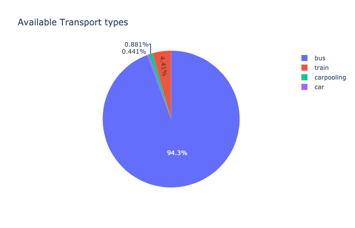
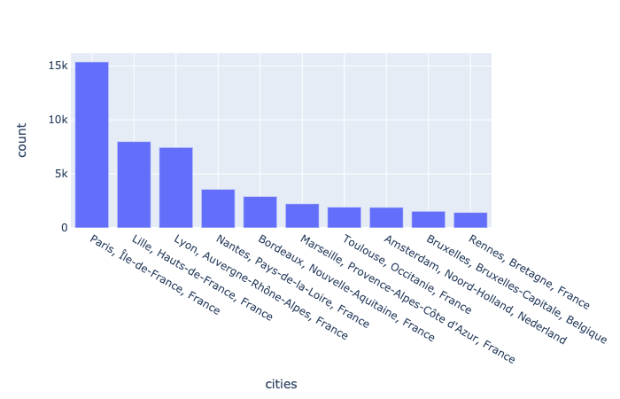
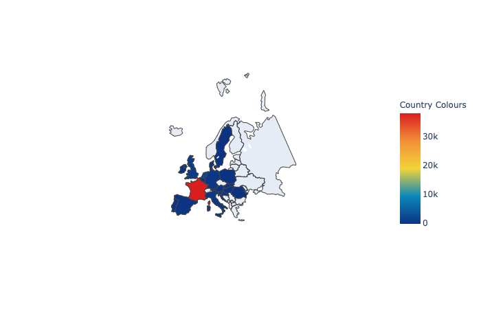
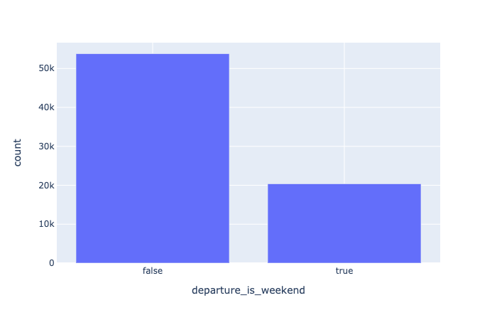
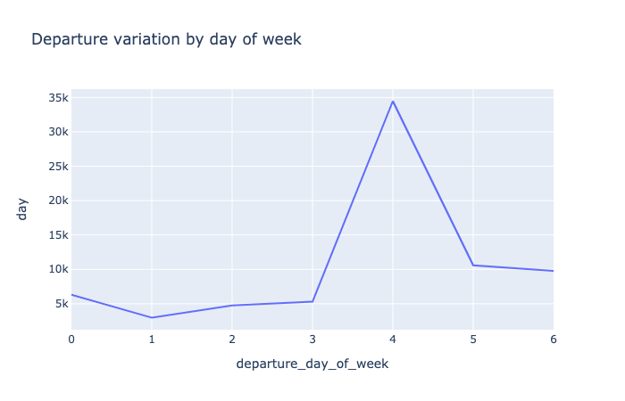
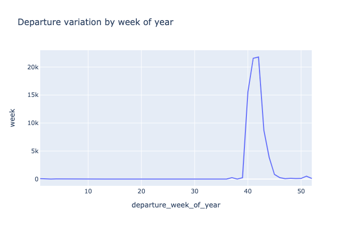
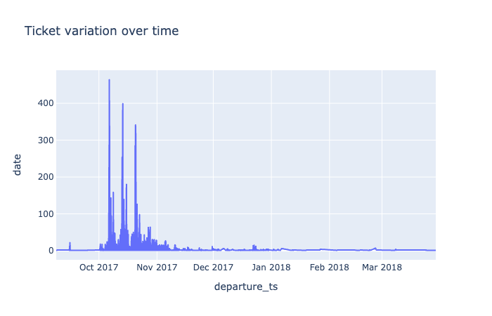

# Test technique Tictactrip (Remarques):
Pour la partie visualisation, la librairie Plotly a été utilisée. Malheureusement, GitHub ne permet pas de lire son output.
Voici les images qui ne sont pas affichées dans le fichier .ipynb:  

## Types de transport (Pie Chart):  

## Villes les plus visitées (Bar plot):  

## Map des villes les plus visitées:  

## Comparaison des departs: Weekends VS. Workdays (Bar plot):

## Line plot des départs en fonction des jours de la semaine:

## Line plot des départs en fonction des semaines de l'année:

## Line plot des départs en fonction des dates données:

